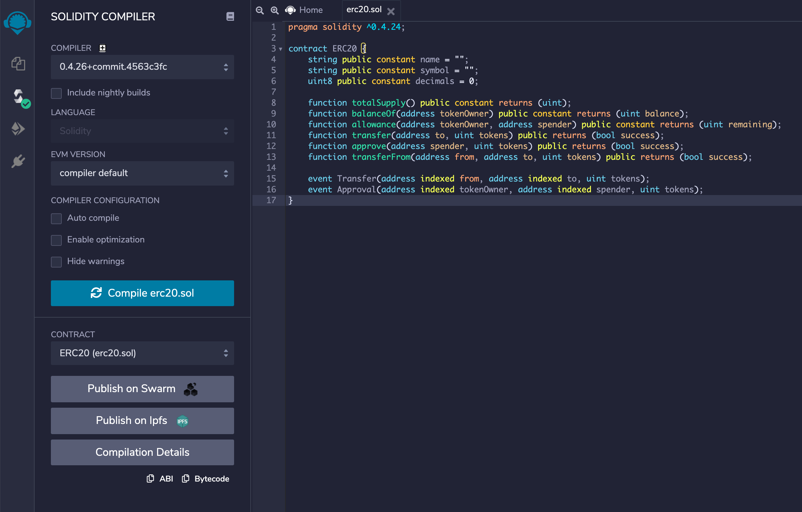

[TOC]

# 概述

非以太币的ERC20代币其它操作

# 详细描述

生成新的代币类型.用于交易操作

# 操作流程

## abi文件的生成

1. 进入 编辑器: https://remix.ethereum.org
2. 创建文件
3. 添加erc20.sol中的接口文本,保存
4. 点击 SOLIDITY COMPILER
5. 直接点击最下方abi copy即可.

## 使用abigen 成从ABI创建Go文件

- aibgen工具生成命令(限标准目录):
    - go get -u github.com/ethereum/go-ethereum
    - cd $GOPATH/src/github.com/ethereum/go-ethereum/cmd/abigen
    - go build main.go

- 将abi文件放入abigen的文件夹中.用生成的二进制文件main运行.
    - $ ./main --abi=erc20.abi --pkg=token --out=erc20.go
    - 生成go文件
    - 可copy到使用环境