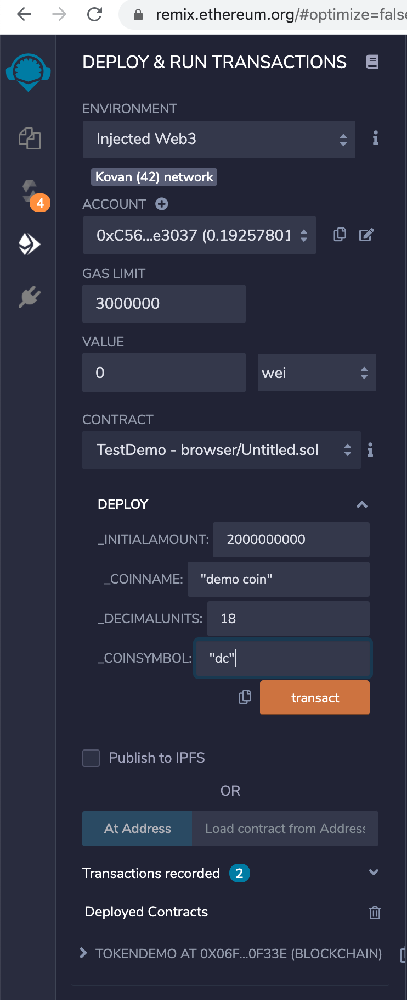
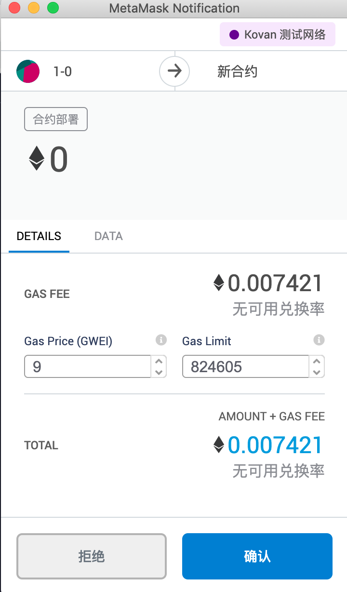
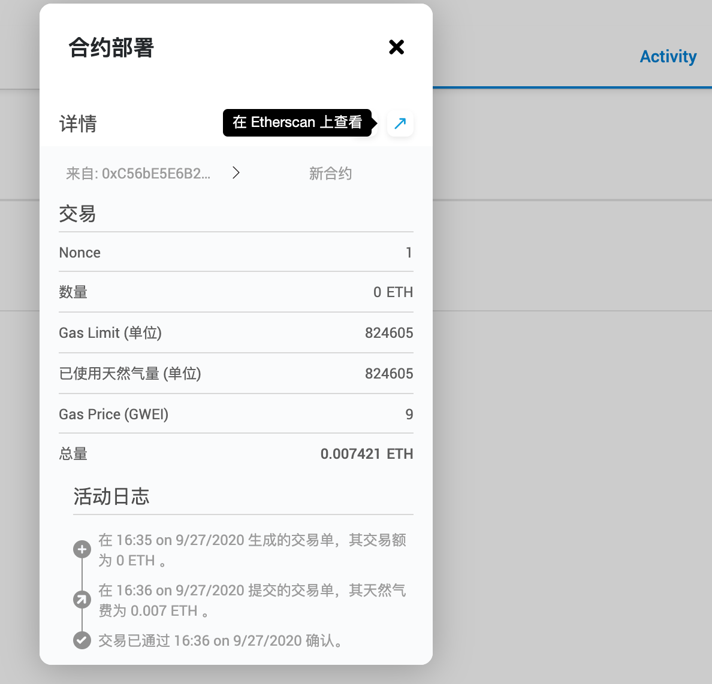
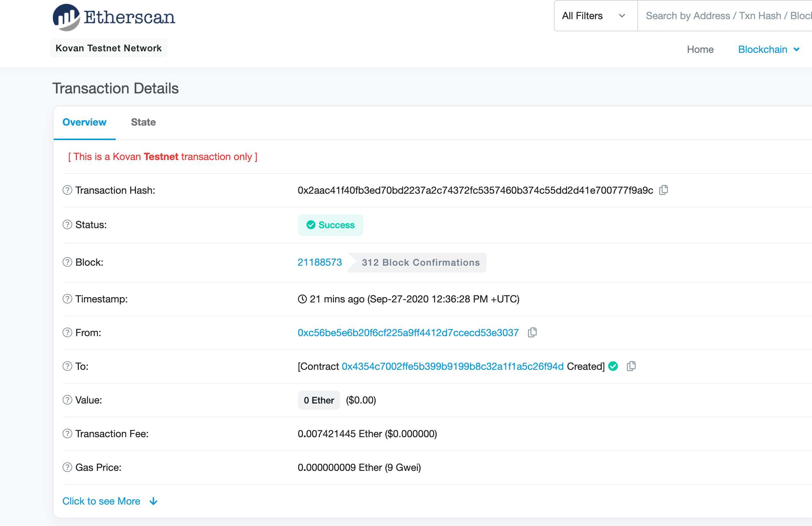
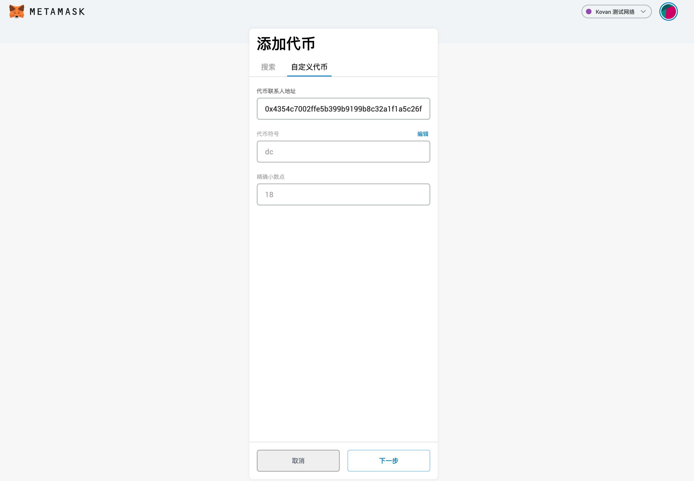

[TOC]

# 概述

基于ERC20编写的一个代币合约

# 详细描述

这是用于测试代币的发布,需要使用合约.添加操作流程.
智能合约是一个确定性的计划,当满足某些条件时，它则执行特定任务.

# 测试环境

## 搭建配置

- Remix+MetaMask测试环境部署
    - 合约编辑器Remix: https://remix.ethereum.org
    - MetaMask网页钱包.下载地址: https://metamask.io/download.html
        - 需要导入钱包.
        - 使用的环境是: kovan测试网络.
        - ~~测试节点地址:https://kovan.infura.io/v3/a03abba5fea243679103ca290b20b7b6~~
    - 创建合约需要使用gas
        - gas与以太币具有汇率关系.
        - 获取用于**测试**的以太币,地址: https://github.com/kovan-testnet/faucet

# 部署流程

## 合约创建

1. 进入合约编辑器.添加testCoin文件中的代码.
2. 保存使用左侧的以太坊编译/部署(deploy & run transactions)
    - ENVIRONMENT 使用 injected web3.
        - 会打开浏览器插件MetaMask进行测试部署
        - account选择具有以太币的账户.合约进行部署需要使用gas.
        - gas limit 默认.
        - value 为 0.(当value为0.且只有data时.则表示为一个合约.)
        - CONTRACT 选择实现合约接口的 TestDemo.进行 deploy 操作.

3. deploy参数
    - _INITIALAMOUNT: 发币总量.如: 2000000000
    - _COINNAME: 币的名称.如: "demo coin"
    - _DECIMALUNITS: 币的精度. 如: 18
    - _COINSYMBOL: 币的简称.如: "dc"

4. 执行 transact.进行部署操作

5. 部署后.进入MetaMask钱包.查看Activity.点击合约部署记录.查看详情.

6. 在以太坊里查看部署详情.
    - Transaction Hash: 表示该笔交易(合约也是一种交易)的hash值
    - status: 合约部署状态
    - Block: 当前合约所处的区块位置(kovan测试环境),与已经被确认的区块链数量
    - From: 合约创建者的地址.(个人地址)
    - To: 部署的代币合约地址(添加代币使用的代币联系地址)

7. 代币的开发部署完成.
    - 进入钱包导入自定义代币.使用to的地址.
    - 进行交易处理.

